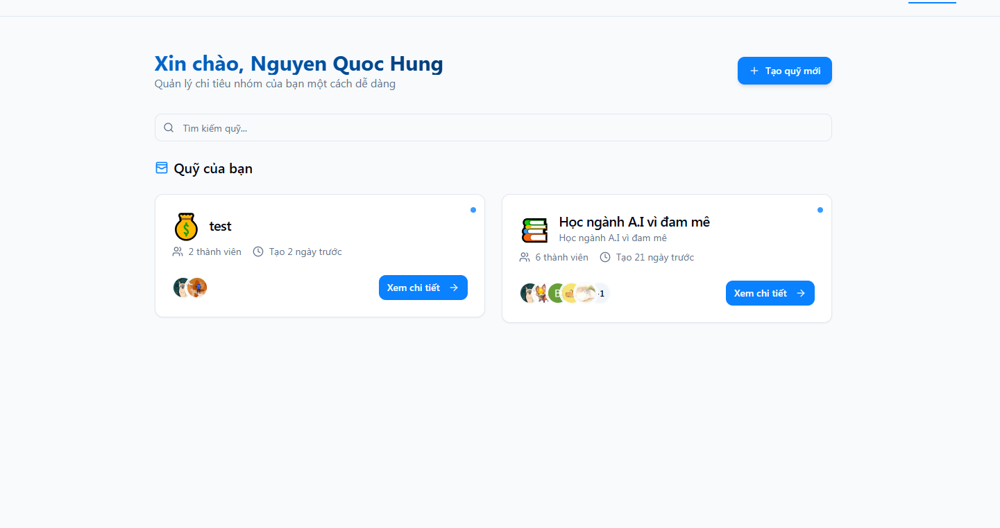
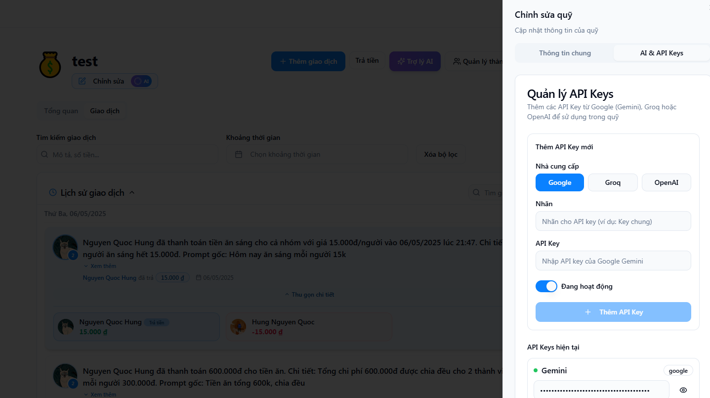
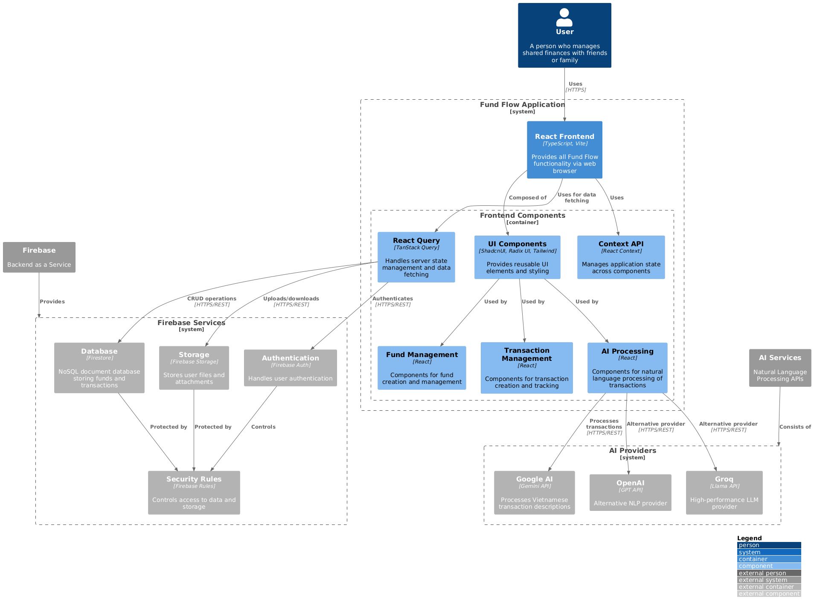

# Để Tui Trả

## Pain Point

### Vietnamese

Trong những lần đi ăn, đi chơi chung cùng bạn bè, đồng nghiệp, một trong những vấn đề mà mình hay gặp là liên tục phải lưu lại việc mọi người nợ nhau bao nhiêu tiền, ví dụ tạt qua 1 quán kem, đi qua 1 hàng ăn, và thường sẽ có 1 người đứng ra trả tiền, sau đó người này nợ người kia, người kia lại nợ người này, ....

Từ những giải pháp như lưu trữ bằng tin nhắn, rồi ghi chú lại. Mình đã làm ra 1 sản phẩm với mục tiêu chính là giúp lưu trữ lại những thông tin chuyển khoản, với 1 số điểm hỗ trợ sau

- Tập trung cải thiện UI/UX để việc tạo giao dịch trở lên nhanh chóng, rất ít nút và màn hình
- Có A.I Hỗ trợ để có thể nhập các ghi chú phức tạp như "Sáng, Hưng chia tiền cả nhóm 600k, trưa Linh trả tiền ăn 60k, chiều Quỳnh trả cho Hưng, Minh 100k , ...." và A.I sẽ tính toán kết quả cuối ai nợ ai bao nhiêu.
- Hỗ trợ chuyển đổi ngoại tệ ngay trên app, hỗ trợ cho du lịch nước ngoài
- Không có tích hợp với cổng thanh toán nào cả, điều này khác với các app thanh toán như MoMo, Quỹ chia tiền khác, ... nơi mà chúng mình sẽ phải tạo tài khoản trên nền tảng, rồi phải nạp tiền vào nền tảng đó, ... và bị gắn chặt với nền tảng. Hệ thống sẽ cho phép bạn đăng kí STK  Ngân Hàng/ Ngân hàng của bản thân, và chỉ lưu trữ ,khi trả tiền ai thì hệ thống hiển thị QR người kia để nhanh chóng chuyển tiền.

### English

In group outings, one common issue is keeping track of who owes what to whom, especially when multiple people are involved in paying for shared expenses. This often leads to confusion and the need for meticulous record-keeping.

To address this, I've developed a product aimed at simplifying the process of recording and managing these transactions, with several key features:

- Focus on improving UI/UX for quick transaction creation with minimal buttons and screens.
- AI support for parsing complex notes like "In the morning, Hung paid 600k for the group, in the afternoon, Linh paid 60k for lunch, and in the evening, Quynh paid 100k to Hung and Minh." The AI will calculate the final balances between users.
- Support for currency conversion within the app, catering to international travel needs.
- No integration with any payment gateways, unlike other payment apps (e.g., MoMo, shared funds), which require users to create accounts and deposit money into the platform. Instead, our system allows users to register their own bank accounts and only stores transaction information. When settling debts, the system displays the QR code of the recipient for quick payments.


## Demo Image







## 📋 Table of Contents

- [Overview](#overview)
- [System Architecture](#system-architecture)
- [Tech Stack](#tech-stack)
- [Features](#features)
- [Installation](#installation)
- [Setting Up Firebase](#setting-up-firebase)
- [Development](#development)
- [Production Deployment](#production-deployment)
- [Security Considerations](#security-considerations)
- [Contributing](#contributing)

## 🌐 Overview

Để Tui Trả Style is a responsive web application designed to simplify shared expense management. It enables users to create funds for different groups, add members, track transactions, and automatically calculate balances with support for Vietnamese language processing.

The application solves the common problem of tracking "who owes who" in shared expenses scenarios, with particular optimization for Vietnamese language patterns when describing expense splits.

## 🏗️ Overview Architecture



The application architecture follows a modern client-side approach with Firebase as the backend, featuring advanced natural language processing through multiple AI services.

### Architectural Layers

1. **Frontend Layer**: 
   - React application with TypeScript and Vite build system
   - Modular components organized by functionality
   - Responsive design for all device sizes

2. **State Management**: 
   - React Query for server state and optimized data fetching
   - Context API for application-wide state sharing
   - Local component state for UI interactions

3. **Backend Services**: 
   - Firebase Authentication for secure user management
   - Firestore for real-time NoSQL database storage
   - Firebase Storage for files and attachments
   - Robust security rules enforcing access controls

4. **AI Integration**: 
   - Multiple AI service providers (Google, OpenAI, Groq)
   - Natural language processing optimized for Vietnamese
   - API key management at the fund level for team sharing
   - Usage tracking and statistics

5. **Security**: 
   - Comprehensive Firebase security rules
   - Environment variable configuration
   - Protected API key storage

## 🛠️ Tech Stack

- **Frontend Framework**: React 18 with TypeScript
- **Routing**: React Router 6
- **State Management**: React Query, React Context API
- **UI Components**: ShadcnUI, Radix UI, Tailwind CSS
- **Build Tool**: Vite
- **Backend**: Firebase (Authentication, Firestore, Security Rules)
- **External APIs**: Google AI, OpenAI, Groq
- **Package Manager**: npm/bun

## ✨ Features

### Authentication & User Management
- Firebase Authentication integration
- Protected routes and user profiles

### Fund Management
- Create and manage shared funds
- Add/remove members to funds
- Archive funds
- Fund settings and customization

### Transaction Tracking
- Add, edit, delete transactions
- Split expenses among members
- Natural language processing for Vietnamese expense descriptions
- Multiple transaction categorization options

### AI Integration
- Smart parsing of expense descriptions
- Support for multiple AI models (Gemini, Llama 3, etc.)
- API key management per fund
- Usage tracking and statistics

### Mobile Optimization
- Responsive design for all devices
- Touch-friendly controls
- Optimized input mechanisms for mobile

## 🚀 Installation

### Prerequisites

- Node.js 18+ or Bun
- Firebase account
- (Optional) AI service API keys (Google, OpenAI, Groq)

### Setup

1. Clone the repository

```bash
git clone https://github.com/quochung-cyou/FundFlow.git

```

2. Install dependencies

```bash
npm install
# or with Bun
bun install
```

3. Create environment file

```bash
cp .env.example .env
```

4. Update the `.env` file with your Firebase and API credentials

## 🔥 Setting Up Firebase

1. Create a new Firebase project at [Firebase Console](https://console.firebase.google.com/)

2. Enable Authentication services
   - Go to Authentication > Sign-in method
   - Enable Email/Password and Google providers

3. Set up Firestore database
   - Create a Firestore database in production mode
   - Set up initial security rules

4. Update your Firebase configuration
   - Create `src/firebase/config.ts` with your Firebase project credentials (use `.env` variables)

```typescript
// Import the functions you need from the SDKs you need
import { initializeApp } from "firebase/app";
import { getAuth } from "firebase/auth";
import { getAnalytics } from "firebase/analytics";
import { getFirestore } from "firebase/firestore";

// Your web app's Firebase configuration
const firebaseConfig = {
  apiKey: import.meta.env.VITE_FIREBASE_API_KEY,
  authDomain: import.meta.env.VITE_FIREBASE_AUTH_DOMAIN,
  projectId: import.meta.env.VITE_FIREBASE_PROJECT_ID,
  storageBucket: import.meta.env.VITE_FIREBASE_STORAGE_BUCKET,
  messagingSenderId: import.meta.env.VITE_FIREBASE_MESSAGING_SENDER_ID,
  appId: import.meta.env.VITE_FIREBASE_APP_ID,
  measurementId: import.meta.env.VITE_FIREBASE_MEASUREMENT_ID
};

// Initialize Firebase
const app = initializeApp(firebaseConfig);
export const auth = getAuth(app);
export const analytics = getAnalytics(app);
export const db = getFirestore(app);
export default app;
```

5. Deploy Firebase rules

```bash
npm run deploy-rules
```

## 🧪 Development

```bash
npm run dev
# or with Bun
bun run dev
```

This will start the development server at `http://localhost:5173`

## 📦 Production Deployment

1. Build the application

```bash
npm run build
# or with Bun
bun run build
```

2. Deploy to Firebase Hosting

```bash
firebase deploy
```

## 🔒 Security Considerations

### Important Security Notes

1. **API Keys Protection**
   - DO NOT commit API keys directly in source code
   - Use environment variables for all sensitive credentials
   - If you found hardcoded API keys in `config.ts`, move them to `.env` immediately

2. **Firebase Security Rules**
   - Review and update the Firestore security rules in `firestore.rules`
   - Ensure proper access control for all collections

3. **API Key Management**
   - The application supports storing API keys in Firestore
   - Ensure only authorized users can access these keys

## 🤝 Contributing

Contributions are welcome! Please feel free to submit a Pull Request.

1. Fork the repository
2. Create your feature branch (`git checkout -b feature/amazing-feature`)
3. Commit your changes (`git commit -m 'Add some amazing feature'`)
4. Push to the branch (`git push origin feature/amazing-feature`)
5. Open a Pull Request
